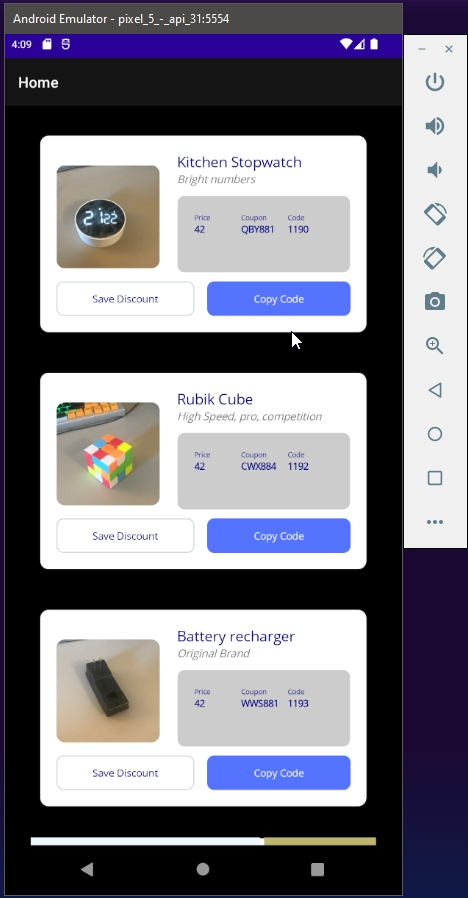

# .Net MAUI documentation

## Pages, Layout and Views

- Page: Pre-defined structures of the app
    - [https://learn.microsoft.com/en-us/dotnet/maui/user-interface/pages/contentpage?view=net-maui-8.0]
- Layout: Organize components
    - [https://learn.microsoft.com/en-us/dotnet/maui/user-interface/layouts/?view=net-maui-8.0]
- Views: components
    - [https://learn.microsoft.com/en-us/dotnet/maui/user-interface/controls/contentview?view=net-maui-8.0]

~~~mermaid
flowchart TD
    Pages --> Layouts
    Layouts --> Views
~~~

### Pages

### Visual 

[](front1.jpg)

#### ContentPage

- [https://learn.microsoft.com/en-us/dotnet/maui/user-interface/pages/contentpage?view=net-maui-8.0]

```
<ContentPage xmlns="http://schemas.microsoft.com/dotnet/2021/maui"
             xmlns:x="http://schemas.microsoft.com/winfx/2009/xaml"
             x:Class="MyMauiApp.MyPage"
             Title="MyPage"
             BackgroundColor="White">
    <StackLayout>
        <Label Text="Welcome to .NET MAUI!"
                VerticalOptions="Center"
                HorizontalOptions="Center" />
        <!-- Other views go here -->
    </StackLayout>
</ContentPage>
```


#### Flex Layout

- [https://learn.microsoft.com/en-us/dotnet/maui/user-interface/layouts/flexlayout?view=net-maui-8.0]

#### NavigationPage

- [https://learn.microsoft.com/en-us/dotnet/maui/user-interface/pages/navigationpage?view=net-maui-8.0]

#### TabbedPage

- [https://learn.microsoft.com/en-us/dotnet/api/microsoft.maui.controls.tabbedpage?view=net-maui-8.0]


### DataTemplates

- [https://learn.microsoft.com/en-us/dotnet/maui/fundamentals/datatemplate?view=net-maui-8.0]


### Absolute Layouts

- [https://learn.microsoft.com/en-us/dotnet/maui/user-interface/layouts/absolutelayout?view=net-maui-8.0]

### Stack Layout

- [https://learn.microsoft.com/en-us/dotnet/maui/user-interface/layouts/stacklayout?view=net-maui-8.0]

### Resources

- [https://learn.microsoft.com/en-us/dotnet/maui/fundamentals/resource-dictionaries?view=net-maui-8.0]


## misc

- the 2 following lines must be included in each Styles xaml file created
    ```xml
        <?xml version="1.0" encoding="utf-8" ?>
        <?xaml-comp compile="true" ?>
    ```
    - also, the xaml should include the BuildAction as "MauiXaml"
    - And lastly, register the resourse in the App.xaml file
    ```xml
    <Application.Resources>
        <ResourceDictionary>
            <ResourceDictionary.MergedDictionaries>
                <ResourceDictionary Source="Resources/Styles/Colors.xaml" />
                <ResourceDictionary Source="Resources/Styles/Styles.xaml" />
                <ResourceDictionary Source="Resources/Styles/myNewStyle.xaml" />
            </ResourceDictionary.MergedDictionaries>
        </ResourceDictionary>
    </Application.Resources>
    ```

- Example of interfaces
    - [https://dribbble.com/shots/17575451-AMA-Learning-App-User-Interface]


